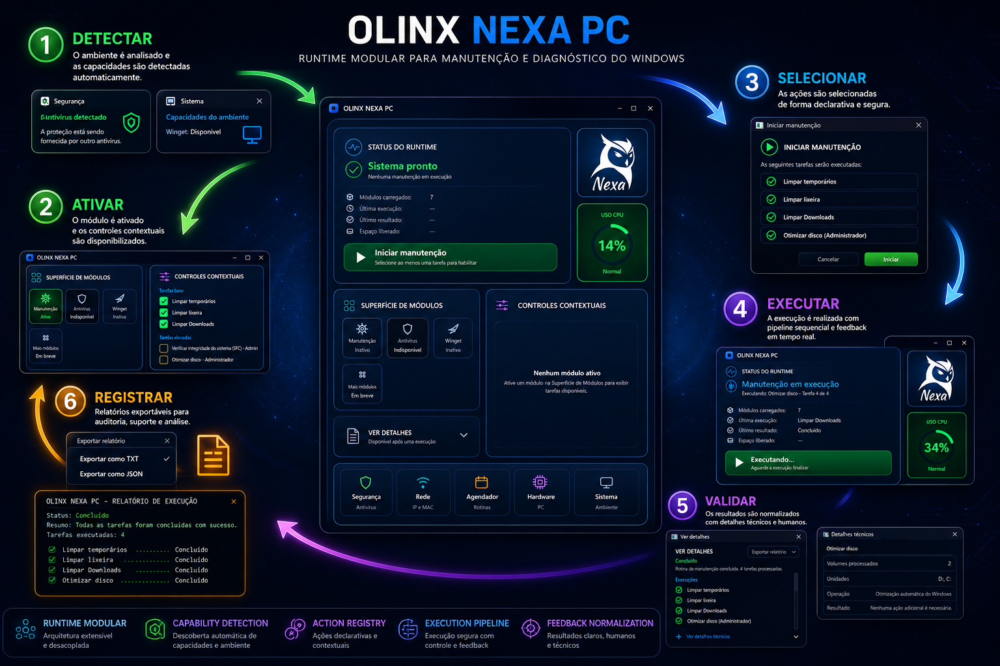

# OLINX NEXA PC

<p align="center">
  
</p>

O **OLINX NEXA PC** é uma aplicação desktop autoral em desenvolvimento, criada em **Python** para manutenção, diagnóstico e automação segura em ambiente Windows.

Mais do que um utilitário tradicional, o projeto explora uma abordagem baseada em **Runtime Modular Declarativo**, separando interface, regras operacionais, execução de processos e feedback técnico.

> Este repositório contém apenas a apresentação pública do projeto.  
> O código-fonte principal permanece privado por conter decisões internas de arquitetura, execução de processos, segurança operacional, automações e estrutura técnica da aplicação.

<p align="right">
  
</p>

---

## Stack principal

<p>
  
  
  
  
  
  
  
  
</p>

---

## Visão geral

O **OLINX NEXA PC** foi pensado como uma superfície operacional contextual para organizar tarefas de suporte, centralizar diagnósticos e executar ações técnicas no Windows com mais controle, rastreabilidade e segurança.

Ferramentas tradicionais de manutenção normalmente misturam interface, regras operacionais e comandos do sistema em uma única camada. O Nexa segue uma abordagem diferente: capacidades do ambiente são tratadas como ações declarativas, executadas por um pipeline controlado de validação, segurança, execução e observabilidade.

Essa separação permite que a aplicação evolua de forma modular, sem acoplar a interface à execução do sistema operacional.

---

## Ciclo operacional

Todo fluxo operacional do Nexa segue um ciclo controlado:

```txt
Detectar
   ↓
Ativar
   ↓
Selecionar
   ↓
Executar
   ↓
Validar
   ↓
Registrar
   ↺
```

Na prática, esse ciclo permite:

- detectar capacidades disponíveis no ambiente;
- ativar módulos compatíveis;
- expor ações contextuais;
- executar tarefas com validação prévia;
- normalizar feedback técnico;
- registrar resultados;
- gerar evidências exportáveis.

---

## Indicadores do projeto

O projeto principal vem sendo desenvolvido de forma incremental, com foco em arquitetura, testes, segurança operacional e validação de comportamento.

<table>
  <tr>
    <td align="center">
      <h3>Python</h3>
      <p>base principal da aplicação</p>
    </td>
    <td align="center">
      <h3>PySide6</h3>
      <p>interface desktop moderna</p>
    </td>
    <td align="center">
      <h3>Runtime</h3>
      <p>execução modular e controlada</p>
    </td>
  </tr>
  <tr>
    <td align="center">
      <h3>Testes</h3>
      <p>validação automatizada de comportamento</p>
    </td>
    <td align="center">
      <h3>ADRs</h3>
      <p>decisões arquiteturais documentadas</p>
    </td>
    <td align="center">
      <h3>Windows</h3>
      <p>foco em manutenção e diagnóstico local</p>
    </td>
  </tr>
</table>

Práticas aplicadas no projeto principal:

- testes automatizados;
- organização modular;
- documentação técnica;
- decisões arquiteturais registradas;
- controle de execução de processos;
- separação entre interface, runtime, serviços e módulos;
- evolução incremental validada por ciclos de teste.

> Os números exatos de linhas de código, arquivos, commits e testes podem ser atualizados conforme o levantamento atual do repositório privado.

---

## Principais recursos

### Interface desktop

- Interface construída com PySide6.
- Layout moderno e contextual.
- Painel de status do runtime.
- Superfície de módulos.
- Controles visuais para execução de tarefas.
- Exibição de progresso e resultados.

### Runtime modular

- Estrutura modular para execução de tarefas.
- Separação entre módulos disponíveis, indisponíveis e planejados.
- Controle de estados da aplicação.
- Descoberta e ativação de capacidades por contexto.
- Preparação para expansão gradual de recursos.

### Manutenção e diagnóstico

- Limpeza de arquivos temporários.
- Verificações do sistema.
- Execução de comandos administrativos.
- Diagnóstico básico do ambiente.
- Organização de resultados.
- Exportação de informações técnicas.

### Execução segura

- Controle de processos.
- Tratamento de timeouts.
- Execução supervisionada.
- Separação entre comandos e interface.
- Prevenção de execuções concorrentes indevidas.
- Registro estruturado de resultados.
- Cuidados com permissões elevadas quando necessário.

### Exportação e rastreabilidade

- Exportação de resultados.
- Registro de tarefas executadas.
- Status agregado da rotina.
- Separação entre sucesso, alerta, erro e timeout.
- Geração de evidências em formatos estruturados.

---

## Arquitetura

O projeto foi organizado com foco em modularidade, clareza e separação de responsabilidades.

Estrutura conceitual do projeto principal:

```txt
olinx-nexa-pc/
├── core/                 # Runtime, contratos, execução, segurança e ciclo de vida
├── modules/              # Módulos de diagnóstico, manutenção e automação
├── shared/               # Recursos compartilhados e estruturas auxiliares
├── tests/                # Testes automatizados
├── scripts/              # Validações e rotinas auxiliares
└── architecture/ADR/     # Decisões arquiteturais documentadas
```

A arquitetura prioriza:

- baixo acoplamento;
- contratos explícitos;
- módulos independentes;
- execução controlada de processos;
- feedback operacional normalizado;
- documentação de decisões;
- validação contínua da estrutura.

---

## Filosofia técnica

### Separação de responsabilidades

Cada camada possui uma função específica dentro do fluxo operacional:

```txt
UI
↓
Shell Runtime
↓
Actions & Feedback
↓
Services
↓
System Executor
↓
Windows
```

A interface apresenta contexto e recebe interações.  
O runtime coordena estados e capacidades.  
As ações descrevem intenções operacionais.  
Os serviços encapsulam regras técnicas.  
O executor interage com o sistema operacional de forma controlada.

Essa separação reduz acoplamento e mantém a execução do Windows isolada da camada visual.

### Segurança por padrão

Toda ação operacional é tratada como uma capacidade controlada.

O projeto privilegia uma abordagem **fail closed**, onde:

- capacidades indisponíveis são bloqueadas;
- operações inseguras não são executadas;
- ações sensíveis exigem validação;
- elevação de privilégios ocorre de forma controlada;
- módulos operam apenas dentro dos contratos declarados;
- resultados são registrados de forma estruturada.

### Evolução modular

Funcionalidades são organizadas como módulos independentes.

Novas capacidades podem ser adicionadas sem alterar o núcleo da aplicação, desde que respeitem os contratos do runtime. O sistema descobre, registra e disponibiliza módulos de forma controlada, preservando estabilidade entre as camadas.

---

## Qualidade e validação

O projeto mantém validação contínua com testes automatizados e verificação arquitetural.

As validações cobrem áreas como:

- runtime;
- execução;
- persistência;
- módulos;
- exportação de resultados;
- feedback operacional;
- regras críticas de segurança;
- comportamento em falhas e timeouts;
- contratos entre camadas.

Comandos utilizados no projeto principal:

```powershell
.\.venv\Scripts\python.exe -m pytest tests\runtime
.\.venv\Scripts\python.exe -m compileall core shared modules tests
.\scripts\check_architecture.ps1
```

---

## Documentação técnica

O projeto principal possui documentação interna cobrindo:

- arquitetura modular;
- runtime declarativo;
- ciclo operacional;
- controle de processos;
- execução segura;
- feedback operacional;
- exportação de evidências;
- interface desktop;
- decisões arquiteturais via ADRs;
- evolução planejada;
- limitações conhecidas.

As decisões arquiteturais são registradas em:

```txt
architecture/ADR/
```

---

## Status

🚧 **Em desenvolvimento ativo.**

Status atual:

- Runtime modular em evolução.
- Interface principal em desenvolvimento.
- Módulos iniciais de manutenção e diagnóstico em construção.
- Exportação de evidências em TXT e JSON conforme módulos.
- Testes automatizados em expansão.
- Documentação técnica em evolução.
- Repositório principal mantido privado.
- Repositório público usado apenas como apresentação.

---

## Por que o código-fonte não está público?

O código-fonte principal permanece privado porque o projeto inclui:

- decisões internas de arquitetura;
- estratégias de execução de processos;
- comandos e automações operacionais;
- regras de segurança;
- estrutura real do runtime;
- módulos em desenvolvimento;
- documentação interna;
- validações arquiteturais;
- evolução técnica ainda em andamento.

Este repositório existe para apresentar o projeto de forma pública, profissional e segura.

---

## Autor

Desenvolvido por **Gilberto Dalcin**.

<p>
  <a href="https://linkedin.com/in/gilbertodalcin" target="_blank">
    
  </a>
  &nbsp;&nbsp;
  <a href="https://github.com/gibadalcin" target="_blank">
    
  </a>
  &nbsp;&nbsp;
  <a href="https://www.olinx.com.br" target="_blank">
    
  </a>
</p>

---

## Observação

O **OLINX NEXA PC** representa uma construção autoral voltada a explorar desenvolvimento desktop com Python, arquitetura modular, automação local, segurança operacional, documentação técnica e evolução incremental de uma aplicação voltada a suporte e manutenção em ambiente Windows.
